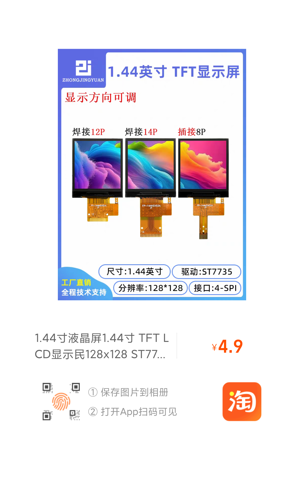

# 相关资料

- DShanMCU-RA6M5配套学习资料 (百问网)
- 野火【RA系列开发板】资料 (野火)
- [RA Flexible Software Package Documentation: Introduction](https://renesas.github.io/fsp/index.html)
- RA6M4 Datasheet (官网)
- RA6M4 User’s Manual (官网)

# 模块参考资料

## 1.44 TFT-LCD 裸屏(使用的插接8P)

