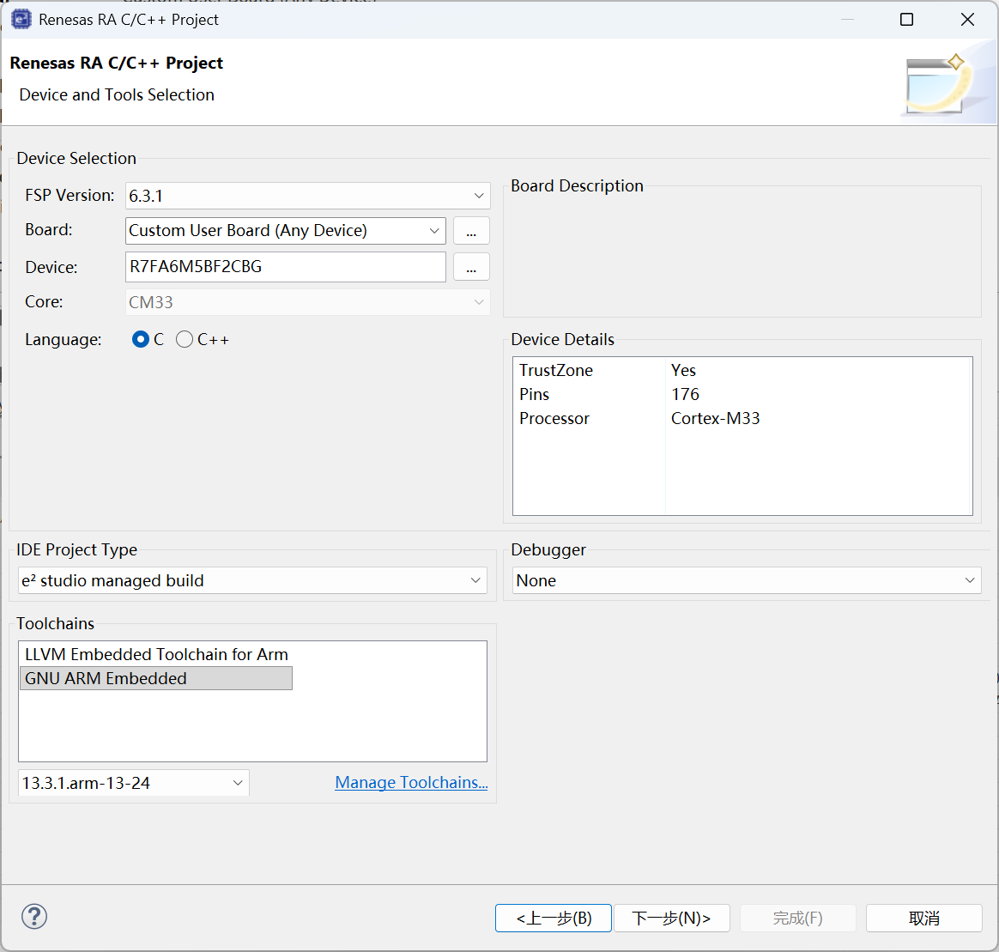
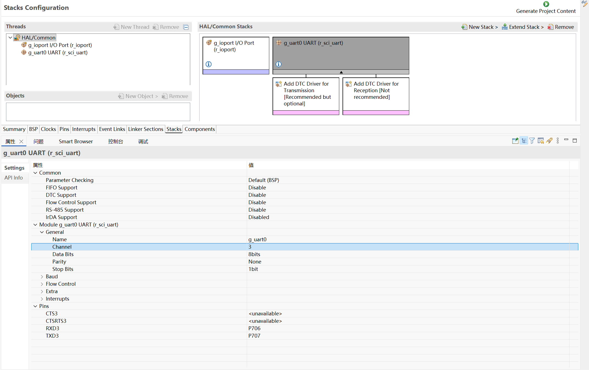
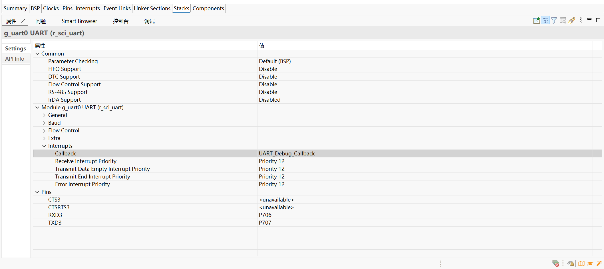

# UART_Debug

# 项目创建



# 图形化配置

## 添加`r_sci_uart`​,配置串口通道`Channel`​和引脚`Pins`



## 设置中断回调函数`Callback` (UART_Debug_Callback)



‍

> [!NOTE] ✏️ SCI_UART的串口回调信息
> ```c
> /** UART Callback parameter definition */
> typedef struct st_uart_callback_arg
> {
>     uint32_t     channel;              ///< Device channel number
>     uart_event_t event;                ///< Event code
>
>     /** Contains the next character received for the events UART_EVENT_RX_CHAR, UART_EVENT_ERR_PARITY,
>      * UART_EVENT_ERR_FRAMING, or UART_EVENT_ERR_OVERFLOW.  Otherwise unused. */
>     uint32_t data;
>     void   * p_context;                ///< Context provided to user during callback
> } uart_callback_args_t;
>
> typedef enum e_sf_event
> {
>     UART_EVENT_RX_COMPLETE   = (1UL << 0), ///< Receive complete event (调用read，接收完所有数据)
>     UART_EVENT_TX_COMPLETE   = (1UL << 1), ///< Transmit complete event (调用write，传输完所有数据)
>     UART_EVENT_RX_CHAR       = (1UL << 2), ///< Character received (未调用read，但接收到了一字节数据)
>     UART_EVENT_ERR_PARITY    = (1UL << 3), ///< Parity error event
>     UART_EVENT_ERR_FRAMING   = (1UL << 4), ///< Mode fault error event
>     UART_EVENT_ERR_OVERFLOW  = (1UL << 5), ///< FIFO Overflow error event
>     UART_EVENT_BREAK_DETECT  = (1UL << 6), ///< Break detect error event
>     UART_EVENT_TX_DATA_EMPTY = (1UL << 7), ///< Last byte is transmitting, ready for more data (调用write，传输一个字节)
> } uart_event_t;
> ```

# 代码编写

## 文件结构


## `uart_debug.c`

```c
/* V1.0 UART_Debug */

#include <UART_Debug/uart_debug.h>

/* 调试串口初始化函数 */
void UART_Debug_Init(void)
{
   fsp_err_t err = FSP_SUCCESS;

   err = R_SCI_UART_Open (&g_uart0_ctrl, &g_uart0_cfg);
   assert(FSP_SUCCESS == err);
}

/* 发送完成标志 */
volatile bool uart_receive_complete_flag = false;
volatile bool uart_send_complete_flag = false;

/* 串口中断回调 */
void UART_Debug_Callback (uart_callback_args_t * p_args)
{
    switch (p_args->event)
    {
        case UART_EVENT_RX_COMPLETE:
        {
            uart_receive_complete_flag  = true;
            break;
        }
        case UART_EVENT_TX_COMPLETE:
        {
            uart_send_complete_flag     = true;
            break;
        }
        case UART_EVENT_RX_CHAR:
        {
            /* 回显 */
            R_SCI_UART_Write(&g_uart0_ctrl, (uint8_t *)&(p_args->data), 1);
            break;
        }
        default:
            break;
    }
}


#if defined __GNUC__ && !defined __clang__
int _write(int fd, char *pBuffer, int size); //防止编译警告
int _read(int fd, char *pBuffer, int size);

/* 重定向 printf 输出 */
int _write(int fd, char *pBuffer, int size)
{
   (void) fd;
   R_SCI_UART_Write (&g_uart0_ctrl, (uint8_t*) pBuffer, (uint32_t) size);
   while (uart_send_complete_flag == false);
   uart_send_complete_flag = false;

   return size;
}

/* 重定向scanf函数 */
int _read(int fd, char *pBuffer, int size)
{
    (void) fd;

    R_SCI_UART_Read (&g_uart0_ctrl, (uint8_t*) pBuffer, (uint32_t) size);
    while (uart_receive_complete_flag == false);
    uart_receive_complete_flag = false;

//    /* 回显 */
//    R_SCI_UART_Write (&g_uart0_ctrl, (uint8_t*) pBuffer, (uint32_t) size);

    return size;
}

#else
int fputc(int ch, FILE *f)
{
    (void)f;
   R_SCI_UART_Write(&g_uart0_ctrl, (uint8_t *)&ch, 1);
   while(uart_send_complete_flag == false);
   uart_send_complete_flag = false;

   return ch;
}
#endif

```

## `uart_debug.h`

```c
/* V1.0 UART_Debug */

#ifndef UART_DEBUG_H
#define UART_DEBUG_H

#include "hal_data.h"
#include <sys/stat.h>
#include <unistd.h>
#include <errno.h>

void UART_Debug_Init(void);

/* 函数声明 防止编译器警告 */
int _isatty(int fd);
int _close(int fd);
int _lseek(int fd, int ptr, int dir);
int _fstat(int fd, struct stat *st);

 __attribute__((weak)) int _isatty(int fd)
 {
     if (fd >= STDIN_FILENO && fd <= STDERR_FILENO)
         return 1;

     errno = EBADF;
     return 0;
 }

 __attribute__((weak)) int _close(int fd)
 {
     if (fd >= STDIN_FILENO && fd <= STDERR_FILENO)
         return 0;

     errno = EBADF;
     return -1;
 }

 __attribute__((weak)) int _lseek(int fd, int ptr, int dir)
 {
     (void) fd;
     (void) ptr;
     (void) dir;

     errno = EBADF;
     return -1;
 }

 __attribute__((weak)) int _fstat(int fd, struct stat *st)
 {
     if (fd >= STDIN_FILENO && fd <= STDERR_FILENO)
     {
         st->st_mode = S_IFCHR;
         return 0;
     }

     errno = EBADF;
     return 0;
 }

#endif /* UART_DEBUG_UART_DEBUG_H_ */

```

## `hal_entry.c`

```c
/* 包含头文件 */
#include <stdio.h>
#include <UART_Debug/uart_debug.h>
```

‍

```c
    /* TODO: add your own code here */
    UART_Debug_Init();

	/* 使用示例 */
    while(1){
        static char arr[10]="Hello";
        scanf("%s",arr);
        printf("%s",arr);
        // R_BSP_SoftwareDelay(1000, BSP_DELAY_UNITS_MILLISECONDS);
    }
```‍
