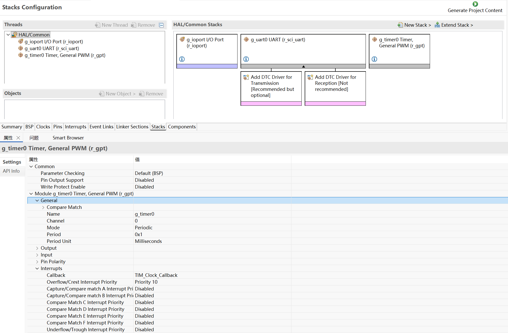
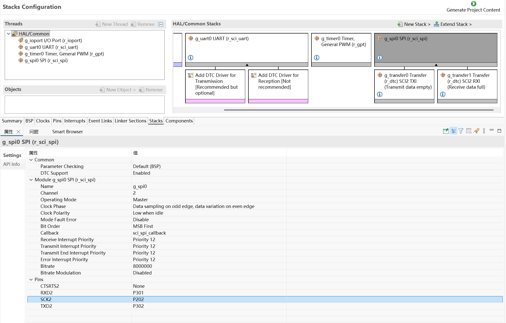
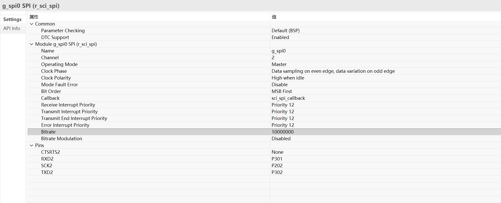
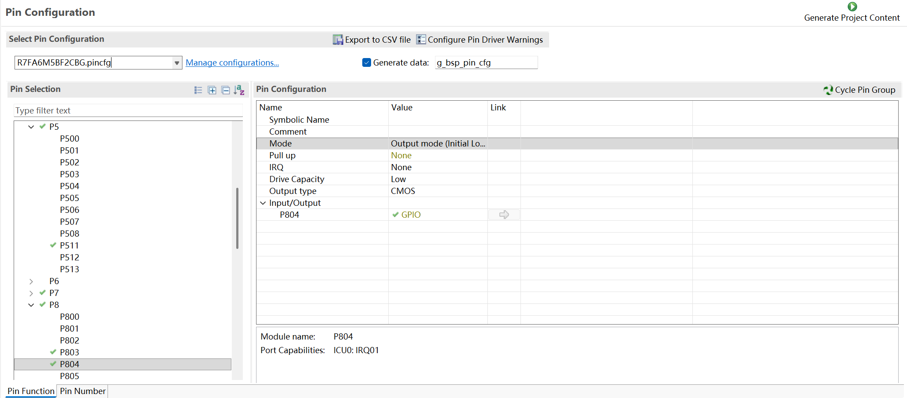
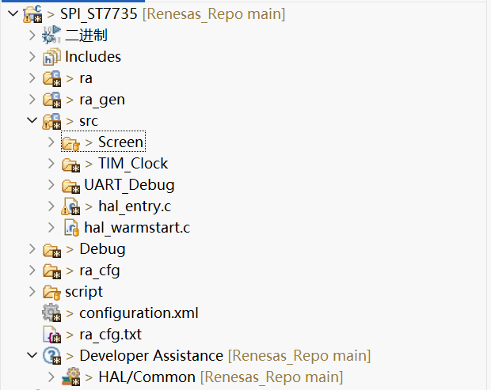

# SPI_ST7735

# 项目创建


# 图形化配置

## 添加`r_sci_uart`,配置和之前一致

## 添加`r_gpt`​,配置`Period`​和`Period Unit`​,配置定时器的中断回调`Callback`​ (TIM\_Clock_Callback)



## 添加`r_sci_spi`​,配置`Channel`​和`Pins`



## 配置`Clock Phase`​和`Clock Polarity`​,提高`Bitrate`



## 配置`Pins`

```c
/* 将以下几个引脚设置为输出,初始化为低电平 */

#define TFT_RES_Pin     BSP_IO_PORT_05_PIN_11
#define TFT_DC_Pin      BSP_IO_PORT_08_PIN_04
#define TFT_CS_Pin 	    BSP_IO_PORT_08_PIN_03
#define TFT_BLK_Pin 	BSP_IO_PORT_00_PIN_02
```



# 代码编写

## 文件结构



复制项目源码中的`Screen`​和`TIM_Clock`文件夹到你的项目
